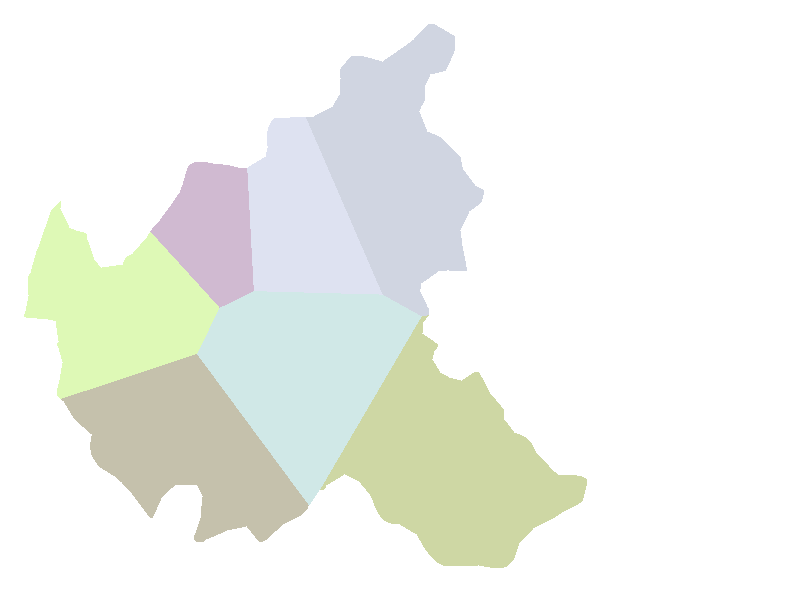
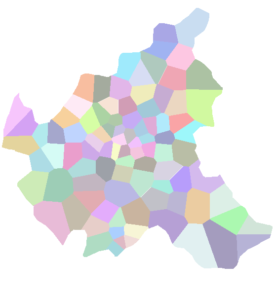
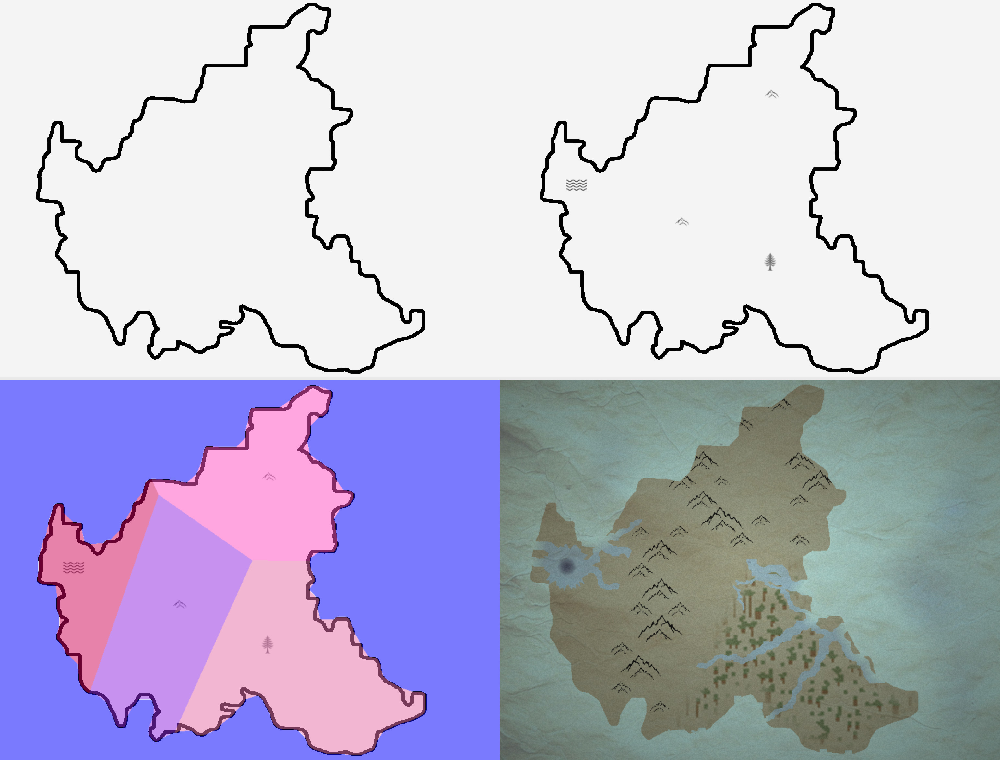
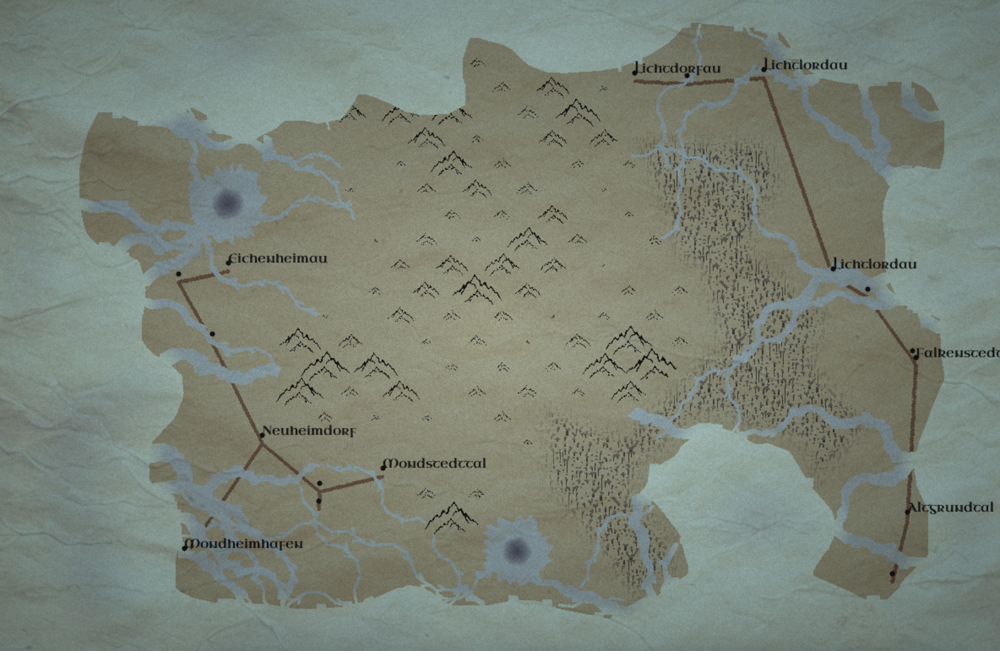

# Sketch-basierte Generierung von fiktionalen Landkarten

Dieser praktische Teil meiner Bachelorarbeit beschäftigt sich mit der **sketch-basierten Generierung von fiktionalen Landkarten**.

Das folgende Beispiel zeigt einen WIP-Umriss von **Hamburg und seinen Bezirken**, generiert durch Voronoi-Diagramme:

Das nächste Beispiel zeigt einen WIP-Umriss von **Hamburg und seinen Stadtteilen**, ebenfalls generiert durch Voronoi-Diagramme:

Sketch -> Icon Placement -> 
Voronoi-Diagramm -> Prozedural generierte Karte: 

Die Gebirgszellen wurden mit Perlin-Noise generiert, der Ozean mit Simplex-Noise, die Seeregion durch zufällige Variationen, das Waldgebiet mithilfe des WFC-Algorithmus und die Flussstrukturen durch L-Systeme.

Kombination aus allen Landschaftstypen in höherer Qualität.